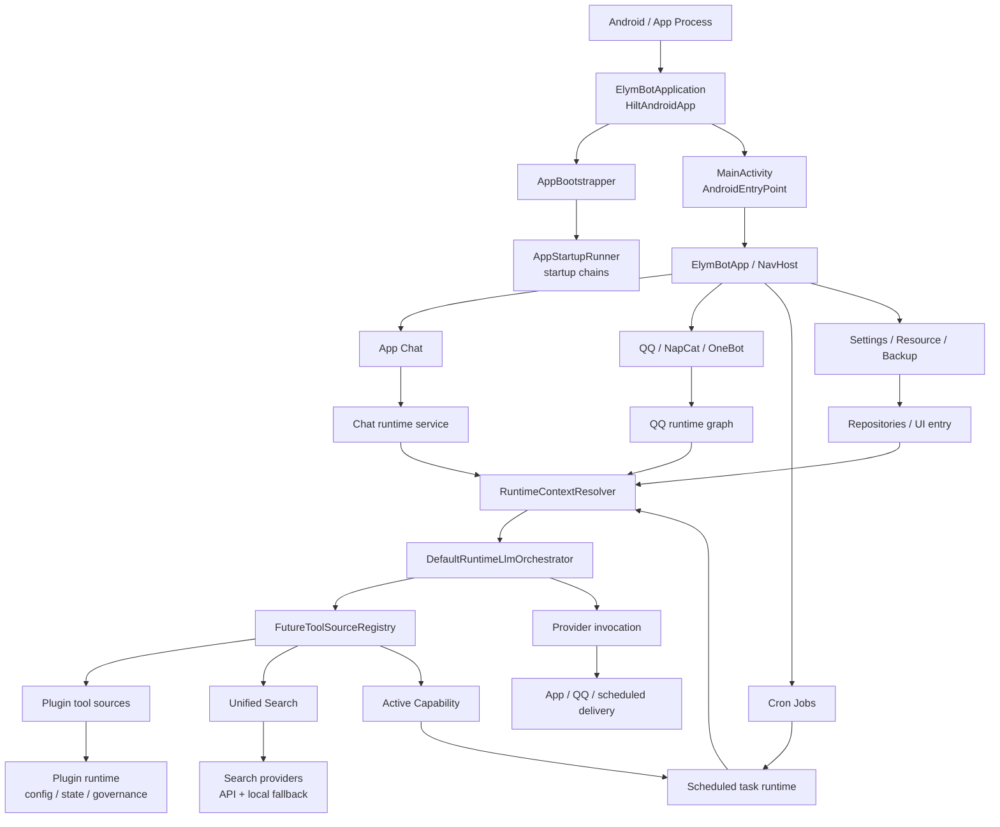
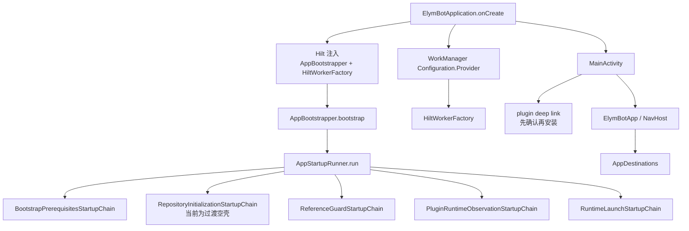
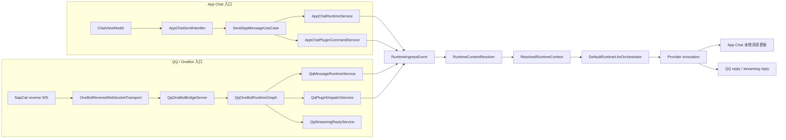
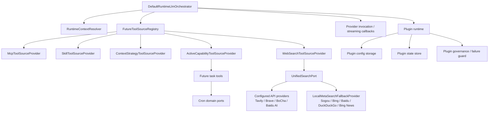
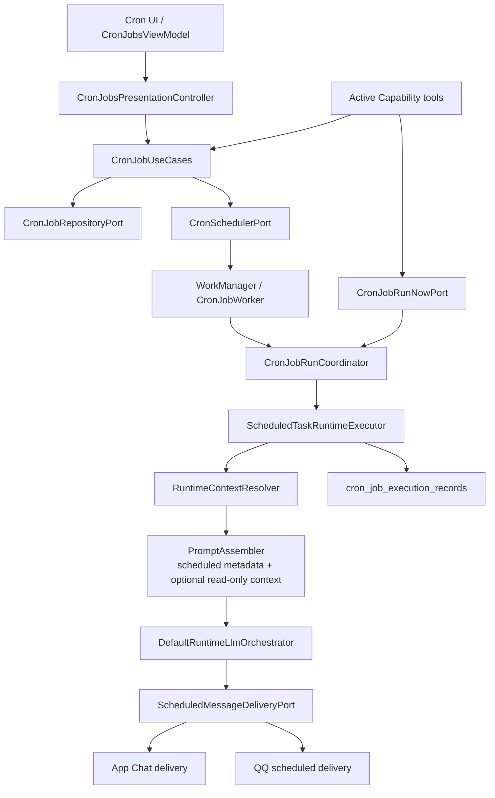
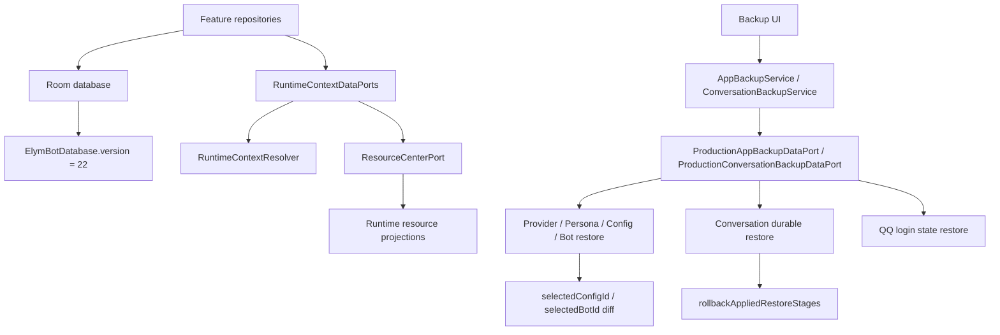

# 11 全链路执行流程图

> 文档层级：辅助总览层
> 阅读时机：只有当你需要跨模块执行链、联动检查或全局流程图时，才补读本文。
> 默认加载优先级：`P2`，默认非必读。
> 真源说明：本文是辅助图，不是主真源，不替代 `README.md`、`../AGENTS.md`、`00_当前基线与迁移摘要.md` 以及 `01` 到 `10` 的模块背景文档。
> 使用建议：读图前先看相关模块文档确认事实；本文只帮助建立链路心智模型，不把新事实单独沉在图里。

## 1. 当前图谱基线

- 基线提交：`e495263`（`Release v0.8.5`）
- 覆盖口径：第 24-26 期后文档同步基线
- `versionCode = 68`
- `versionName = "0.8.11"`
- `ElymBotDatabase.version = 22`
- 项目目录：`<repo-root>`（按本地检出位置解析）
- 本文仍是辅助图；QQ、voiceasset、provider runtime、backup 与 allowlist 的主事实分别回读 `00`、`01`、`05`、`06`、`09`、`10`

本文按当前文档体系重绘为五类链路：

1. 启动与依赖装配链
2. 消息入口与会话运行链
3. LLM、ToolSource、插件与搜索链
4. Cron、主动能力与定时投递链
5. 数据、资源与备份恢复链

## 2. 全链路总拓扑

读图定位：

- 入口、启动、Manifest、Hilt：回读 `01`
- Room、Repository、Backup：回读 `02`
- Provider、Config、Bot、Persona：回读 `03`
- App Chat：回读 `04`
- QQ / NapCat / OneBot：回读 `05`
- STT / TTS / 资产：回读 `06`
- 插件 runtime、ToolSource、治理：回读 `07`
- 插件 UI：回读 `08`
- 设置、日志、资源、备份入口、Cron UI：回读 `09`
- 测试入口和风险：回读 `10`

## 3. 启动与依赖装配链

关键边界：

- 生产主线按 Hilt-only 理解；不要恢复旧 `ElymBotAppContainer` / `ElymBotAppContainer` 作为生产入口。
- `RepositoryInitializationStartupChain` 当前不承载 repository install 主逻辑。
- `:app` 当前只保留 shell / chrome / thin adapter；QQ、voiceasset、provider runtime 与 backup production wiring 不回填成 app direct dependency。
- 插件 deep link 不是打开 URI 后直接安装，而是先进入确认流程。
- Manifest / cleartext / notification / WorkManager 相关事实以 `01` 和对应测试为主真源。

## 4. 消息入口与会话运行链

关键边界：

- App Chat 的发送主线是 `SendAppMessageUseCase`，`ChatViewModel` 只承担 UI state 和用户动作入口。
- QQ 当前真源是 `QqOneBotBridgeServer` 与 `QqOneBotRuntimeGraph`，不要把旧 `OneBotBridgeServer` 写成当前主链。
- QQ data/runtime/presentation 已是 feature owner；`:feature:qq:impl` 不承载 production 主线。
- App Chat 和 QQ 最终共享 `RuntimeContextResolver` 与 `DefaultRuntimeLlmOrchestrator`。
- 插件事件中的 `sessionUnifiedOrigin` 是 session scope 能否稳定定位的重要上下文字段。

## 5. LLM、ToolSource、插件与搜索链

关键边界：

- Web Search 当前主线在 `core/runtime/search/*` 和 `SearchRuntimeModule`，插件侧只保留工具桥接。
- `ProviderCapability.SEARCH` 与搜索 Provider 类型属于 Provider / Config 口径，详情回读 `03`。
- 插件 `storage.plugin` / `storage.session` 当前落到 plugin state 表；session scope 不完整时应按缺失 session scope 处理。
- Active Capability 既能创建未来任务，也能暂停、恢复、查看运行、更新和立即执行任务。

## 6. Cron、主动能力与定时投递链

关键边界：

- Cron UI 不直接拥有调度细节，默认通过 presentation controller、use cases 和 ports 下沉。
- run-now 不是另起一套执行器，而是回到 `CronJobRunCoordinator`。
- `includeScheduledTaskConversationContext` 控制定时任务是否携带最近会话只读上下文。
- 定时任务场景有 `ScheduledTaskIntentGuard` / `ScheduledTaskIntentFallbackResponder`，避免提醒意图漏建或工具误暴露。

## 7. 数据、资源与备份恢复链

关键边界：

- Room 当前统一版本是 `22`，迁移与 schema 事实以 `02` 为主真源。
- Resource Center 可进入 runtime context，但当前 backup manifest 仍未完整覆盖 Resource Center / Cron / Cron execution records / plugin config/state。
- Config backup 已覆盖 `includeScheduledTaskConversationContext`，但不要因此推断所有新增表都已进入备份。
- restore 失败处理要看 durable restore 与 rollback，而不是只看单表写入。
- Backup port closure 已完成，但 compat repository 文件不等于 production static mainline；具体 owner 回读 `09` 和 `10`。

## 8. 跨模块联动检查表

| 如果改动 | 必须补读 |
|---|---|
| Manifest、启动、Hilt、WorkManager、NavHost | `01`、`10` |
| Room schema、Repository、Backup、Restore | `02`、`09`、`10` |
| Provider capability、Config 字段、默认 Bot / Persona | `03`、`02`、`10` |
| App Chat 发送、消息落库、App 内模型调用 | `04`、`07`、`10` |
| QQ reverse WS、OneBot、NapCat、QQ 回复 | `05`、`04`、`07`、`10` |
| TTS、STT、声音资产、容器资产 | `06`、`01`、`09` |
| 插件 runtime、ToolSource、config/state、governance | `07`、`03`、`04`、`05`、`10` |
| 插件市场、详情、配置、工作区 UI | `08`、`07`、`10` |
| Cron、Active Capability、scheduled prompt、run-now | `09`、`03`、`04`、`07`、`10` |
| Unified Search、Web Search、QQ 新闻直送 | `03`、`05`、`07`、`10` |

## 9. 易错点

- 本文不是默认必读，也不是主真源；不要把只出现在本文的内容当成独立事实来源。
- 不要把历史链路写回当前链路：旧容器、旧 singleton、旧 `OneBotBridgeServer` 都不是当前主线。
- 物理路径、包名、类名迁移期间可能不完全同步；判断真源时优先看模块文档列出的当前入口。
- Web Search 现在是核心统一搜索，不是插件私有搜索策略。
- Backup “有恢复链路”不等于“所有新增模块都已覆盖备份 manifest”。
- `11` 只画联动地图；如果发现新事实，必须回填到对应 `01` 到 `10` 模块文档或 `00`，不能只写在这里。
